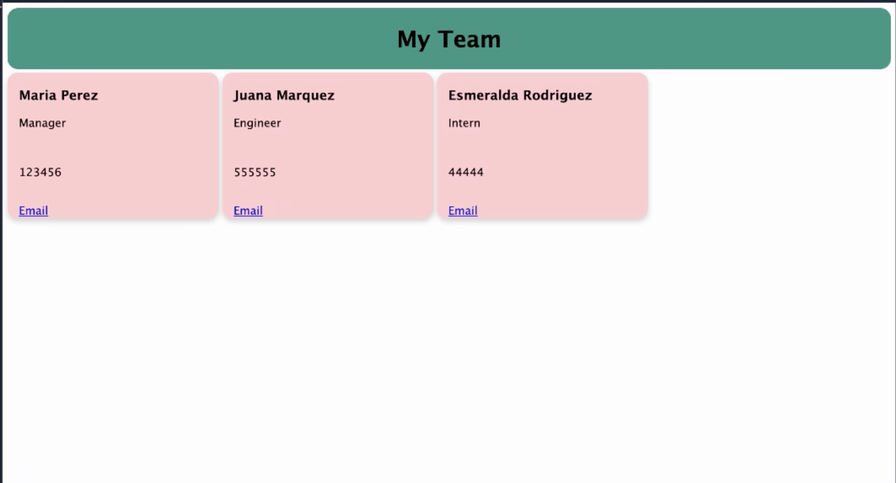

# Team Profile Generator

## The Work Done

*Terminal based application that prompts user to submit data pertaining to Manager, Engineer, and Intern of a team.

*Once all info has been submitted and the user selects 'finish' the application will automatically generate an html file with employee cards.

*A css is already a part of the documents so the html will automatically have styling applied. 

*Classes were used to simplify the coding process and avoid repeating functions.

*Testing is missing from this project.

*[Walkthrough Video Here](https://drive.google.com/file/d/1-MfTpzDU3N88jWuRqVb6uVBWEQNp9MWK/view)

*
